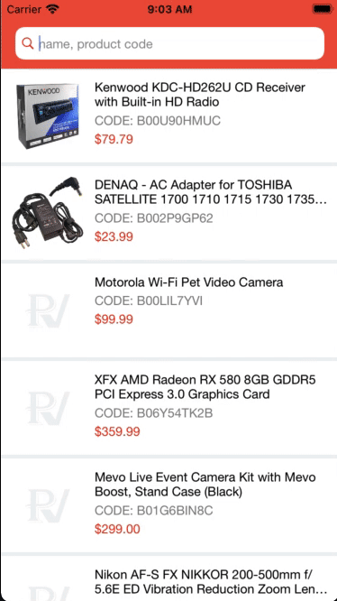
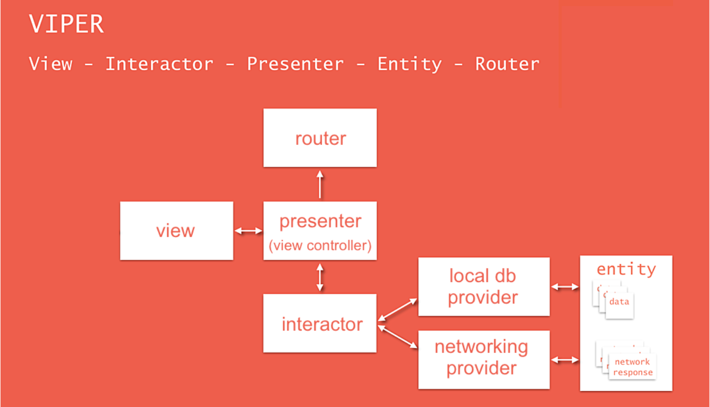
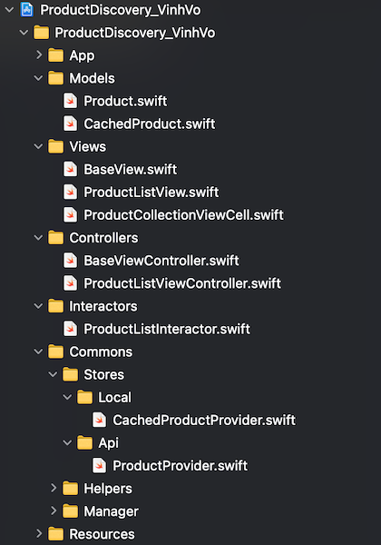

# ProductDiscovery
A demo project that building a UIKit user interface programmatically.
Because the UI is made of code very long so I have separated it from ViewController.
I also separate the business logic from the ViewController. Now the viewcontroller just performs the function as its name suggests.

## Compatibility
- iOS 13 and later
- Swift 5 and later

## Functions
- Call API to get product list
- Store product list to local datadase, so the app can work offline
- Search product list by name and code
- Rank search results by relevance
- Highlisht matched terms in displayed results
- Filter products as user types query
- Localized

## Architecture
A project that uses VIPER for software architecture. VIPER is a backronym for View, Interactor, Presenter, Entity, and Router.

- View: The responsibility of the view is to send the user actions to the presenter and shows whatever the presenter tells it.
- Interactor: This is the backbone of an application as it contains the business logic.
- Presenter (View controller): Its responsibility is to get the data from the interactor on user actions and after getting data from the interactor, it sends it to the view to show it. It also asks the router/wireframe for navigation.
- Entity: It contains basic model objects used by the Interactor.
- Router: It has all navigation logic for describing which screens are to be shown when. It is normally written as a wireframe.

## Project structure

## License
Licensed under the MIT license.
